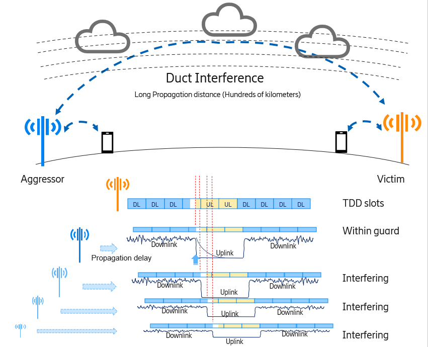

ERICSSON © 2022
# Remote Interference Management (RIM) Radio Application (rApp)

This repository holds the rApp code for the RIM rApp. This file provides a brief overview of the purpose of the RIM rApp 
and the structure of this project pls refer to specific documentation links for implementation details, setup/running instructions etc.

<!-- TOC -->
* [Remote Interference Management (RIM) Radio Application (rApp)](#remote-interference-management--rim--radio-application--rapp-)
* [Remote interference](#remote-interference)
  * [Detection](#detection)
  * [Mitigation](#mitigation)
  * [Related material](#related-material)
* [Implementation](#implementation)
  * [Current status of development](#current-status-of-development)
  * [Data](#data)
  * [Architecture and integration points](#architecture-and-integration-points)
  * [Source code](#source-code)
    * [Structure](#structure)
  * [Contact Information](#contact-information)
      * [Team Members](#team-members)
  * [Glossary](#glossary)
* [Running and Contributing](RunningAndContributing.md) 
<!-- TOC -->

> Gerrit does not render Plantuml embedded in Markdown. Please clone this git repository and open it with a suitable IDE to render the diagrams.

# Remote interference

Remote interference is a generic term referring to interference between cells distant from each other. 
This rApp detects and mitigates remote interference in the context of:
- A 5G TDD network
- Distance way above the one the network has been planned for (hundreds of KMs) 
- Tropospheric ducting conditions. 

Under specific weather conditions ([tropospheric ducting](https://www.dxinfocentre.com/propagation/tr-modes.htm)) the strong down link signal may be curved over the horizon and reach cells located further than the guard distance dictated by the cell [TDD configuration](https://confluence-oss.seli.wh.rnd.internal.ericsson.com/display/PA/Investigate+TDD+pattern+change+applicability+to+RIM). Because of propagation delay the down link signal will overlap in time with the uplink signal, degrading uplink SINR and throughput.
Tropospheric ducting is to a great extent a seasonal problem, most common in warm and humid areas of the planet.  



The cell causing the interference is called **aggressor** and the cell suffering interference is called **victim**.
It is assumed that victims and aggressors operate in conditions of *channel reciprocity*, so a victim would be an aggressor as well, assuming it has enough traffic to generate interference.      

**Notes:**
> This problem does not occur in FDD since down link and up link operate in difference frequencies

> The majority of 5G mid band is TDD

> 5G high band is not likely to suffer this problem since it's mostly used for short range/hotspot deployment

## Detection 

Detecting remote interference due to tropospheric ducting in 5G relies mostly upon [correlated counters](https://cpistore.internal.ericsson.com/elex?LI=EN/LZN7931071R29B&PA=pmradiomaxdeltaipndistr). Unfortunately such counters can be stepped for different reasons (e.g. cross border interference), and are not populated for all the supported TDD patterns. So the RIM rAPP will also process network configuration, weather data, PM counters and employs graph analysis to improve the accuracy of the algorithm before attempting mitigation measures. 
The RIM rApp produces a set of reports that can be exported and analyzed by means of [Jupyter notebooks](https://jupyter.org/) and [Kepler](https://kepler.gl/)

## Mitigation

Mitigating remote interference involves two main actions:

- Increasing uplink power in the cells affected and most overlapping neighbors
- Move traffic to overlapping neighbors (if they are not affected by the same problem)

## Related material

- [RAN study on 5G RIM](https://ericsson.sharepoint.com/:p:/r/sites/Sub-6MBBSystemChina/Shared%20Documents/02.%20MBB%20Common/OA%20for%20NR%20Mid-band%20RIM/PPS825%20NR%20Mid-Band%20RIM%20OA%20Report.pptx?d=we6ae6cdbac8c43d7bf3a0543cae3e642&csf=1&web=1&e=SJkGaJ) including dedicated counters and reference signal (restricted - author may have to grant access)
- [Tropospheric Ducting Forecast for VHF & UHF Radio & TV](https://www.dxinfocentre.com/tropo.html) - Forecasts and information about  tropospheric ducting. The algorithm (and the data) is proprietary. There is no free access to historical data.    
- [Downlink Slot Blanking for TDD Pattern Coexistence](https://cpistore.internal.ericsson.com/elex?LI=EN/LZN7931071*&FN=110_22104-LZA7016017_1Uen.*.html&HT=txj1623328878192&DT=Downlink+Slot+Blanking+for+TDD+Pattern+Coexistence) this RAN feature is limited to specific patterns and is designed for cross border interference however - the counters produced are strongly correlated with interference caused by ducting.
- [ML-based NR Cell Shaping PoC Preparation](https://erilink.ericsson.se/eridoc/erl/objectId/09004cffc670b250?docno=BDGS-21:007797Uen&action=current&format=ppt12) 5G cell shaping POC, and advanced - AI powered algorithm for 5G cell shaping. 
- [Automated cell outage compensation](https://eridoc.internal.ericsson.com/eridoc/?docbase=eridoca&locateId=0b004cff8cbc6949#d2), alarm driven. This feature has been implemented in SON OM, 4G only. It provides great insights on the complexity of antenna tilt mitigation. 
- [RIM rApp Confluence](https://confluence-oss.seli.wh.rnd.internal.ericsson.com/pages/viewpage.action?pageId=505939317) - study pages written during RIM rApp development 

> While the confluence pages may be useful to understand the history of the project and analysis behind it, **they are not an accurate representation of what the code does**, and they are not kept up to date! 

# Implementation 

RIM rApp is implemented mostly java, with python used for scripting, data preparation and visualization. It is a containerized, cloud native [Spring Boot](https://spring.io/projects/spring-boot) application. [Maven](https://maven.apache.org/) is used for the build. 

## Current status of development 

The RIM rApp is currently in **POC state**, partially integrated with EIAP. 
- It has good unit test coverage, but no automated CI pipeline. 
- Can run in 
  - **local mode** (using offline data, for debugging, development and statistical analysis) both on EIAP or on a PC or
  - **integrated mode** (an EIAP instance connected to a real EMS).
- It is **not** vetted for 3PP licenses so not ready for commercial deployment

## Data

While the RIM rApp would run on simulated data it would not produce any meaningful result unless the data is realistic and aligned. That includes PM, CM, geolocation and weather data. The majority of development for the RIM rApp used data from real customers, analyzed by means of [Data exploration service](https://ericsson.sharepoint.com/sites/DataInsights/SitePages/DSI-A-Data-Portal.aspx). Some data may not be available (e.g geolocation) and would have to be requested to the specific customer unit.

## Architecture and integration points 

Please refer to the [EIAP architecture documentation](https://oss-architecture.seli.wh.rnd.internal.ericsson.com/products/current/EIAP/eiap.html) for a general view of where an rApp fits in EIAP. A system view for RIM rApp would be:

```plantuml

@startuml
!include https://raw.githubusercontent.com/plantuml-stdlib/C4-PlantUML/master/C4_Context.puml
!include https://raw.githubusercontent.com/plantuml-stdlib/C4-PlantUML/master/C4_Container.puml

System_Ext(EIAPRT,"EIAP","")
System_Ext(EIAPSDK,"Ericsson Intelligent Automation Platform SDK")

Person(appOperator,"App Operator")
Person(appAdmin,"App Administrator")
Rel_R(appAdmin, EIAPRT, "App Management", "IF.OSS_AE.APPONBOARDING, IF.OSS_AE.APPLCM")
Rel(EIAPSDK,appAdmin,"Deliver Packaged rApp","")
Rel(appOperator, EIAPRT,"Data provisioning, observability","S3, REST")

Person(appDeveloper,"App Developer")
Rel_D(appDeveloper,EIAPSDK,"Uses SDK","")
System(rApp,"RIM rApp")
Rel(appOperator,rApp,"App Operation","")
Rel(rApp,EIAPRT,"PM/weather data loading","CSV on S3")
Rel(rApp,EIAPRT,"CM and topology data loading, CM changes","REST")

@enduml

```
A zoomed in view of the interactions with EIAP - in **blue** the integration points used when running in integrated mode, in **red** the integration points used when running in local mode.
Regardless the integration mode the RIM rApp fetches the required network performance management data from S3. This data format is not available in EIAP, and it is a temporary solution before the RIM rApp is integrated with EIAP KPI service. The PM data for the POC has been prepared offline and preloaded on the EIAP object store.
Weather data has been preloaded on the object store as well, however theer is no plan to change that since it's external data, not owned/managed by EIAP and would require a custom integration depending on the individual customer setup.   

```plantuml

@startuml
!include https://raw.githubusercontent.com/plantuml-stdlib/C4-PlantUML/master/C4_Context.puml
!include https://raw.githubusercontent.com/plantuml-stdlib/C4-PlantUML/master/C4_Container.puml

AddRelTag("localMode", $textColor="red", $lineColor="red")
AddRelTag("integratedMode", $textColor="blue", $lineColor="blue")

System_Boundary(EIAP, "EIAP") {
    ContainerDb_Ext(BDR, "Bulk Data \n Repository")
    Container_Ext(CTS, "Common topology \n service")
    Container_Ext(NCMP, "Network Configuration Management Proxy")
}

Person(appOperator,"App Operator")

System(rApp,"RIM rApp")
Rel(appOperator,rApp,"App Operation","")
Rel(rApp,BDR,"PM/weather data loading","CSV on S3")
Rel(rApp,NCMP,"CM data loading, \n CM changes","REST", $tags="integratedMode")
Rel(rApp,CTS,"Topology data loading","REST", $tags="integratedMode")
Rel(appOperator,CTS,"Topology data provisioning","REST", $tags="integratedMode")
Rel(appOperator,BDR,"Observability","S3")
Rel(appOperator,BDR,"CM/Topology data loading/provisioning","S3", $tags="localMode")


@enduml
```

## Source code 

The RIM rApp has been implemented using the Spring Boot [Microservice Chassis](https://gerrit.ericsson.se/plugins/gitiles/OSS/com.ericsson.oss.de/microservice-chassis/+/refs/heads/master/README.md). 
Jupyter notebooks used for data extraction and visualization are stored in [Gitlab](https://gitlab.rnd.gic.ericsson.se/dsi-a/remote-interference-management) since Gerrit does not have rendering capabilities for notebooks. They are not part of the RIM rApp as such.

### Structure
The RIM rApp is split in two maven modules, 
- [eric-oss-rim-poc-api](eric-oss-rim-poc-api) hosts the application REST endpoints and is based on [Openapi generator](https://openapi-generator.tech/).
- [eric-oss-rim-poc-app](eric-oss-rim-poc-app) hosts the application code and depends on [eric-oss-rim-poc-api](eric-oss-rim-poc-api)

All code is compiled to target directories.

```

├── charts
│         └── eric-oss-rim-poc
│             └── templates
│                 └── tests
├── csar
├── docs
│         └── images
├── eric-oss-rim-poc-api
│         ├── src
│         │         ├── main
│         │         │         └── resources
│         │         │             ├── client
│         │         │             └── v1
│         │         └── template
│         └── target
├── eric-oss-rim-poc-app
│         ├── docs
│         │         └── mitigation
│         ├── src
│         │         ├── main
│         │         │         ├── java
│         │         │         └── resources
│         │         └── test
│         │             ├── java
│         │             └── resources
│         └── target
├── license
├── scripts
```


## Contact Information
#### Team Members

Guardians for this project can be reached at [rApp prototype team](mailto:IDUN_rAppPrototypeTeam@ericsson.onmicrosoft.com).

## Glossary

Here you can find a full 5G [glossary](https://cpistore.internal.ericsson.com/elex?LI=EN/LZN7931071*&FN=1_0033-HSC10550_1-1Uen.*.html&HT=CHAPTER3&DT=Glossary+of+Terms+and+Acronyms).